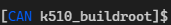

# 勘智K510编译环境

[](https://github.com/kendryte/k510_build_image/actions/workflows/create-container.yml)


## 下载最新镜像
> docker pull ghcr.io/kendryte/k510_env:latest

## 运行容器
```bash
sudo docker run --name k510build --rm -it -v "$(pwd)/k510_buildroot:/opt/k510_buildroot" -v "$HOME/.buildroot-ccache:/opt/build-cache" kendryte/k510_env:latest bash
```
你会看到：



### 高级用法
以非root用户运行：（当前用户应在docker组内）

```bash
docker run \
	--name k510build \
	--rm -it \
	--user "$(id -u):$(id -g)" \
	--env "HOME=/root" \
	-v "$(pwd)/k510_buildroot:/opt/k510_buildroot" \
	-v "$HOME/.buildroot-ccache:/opt/build-cache" \
	-v "/etc/passwd:/etc/passwd:ro" \
	-v "/etc/group:/etc/group:ro" \
	kendryte/k510_env:latest bash
```
